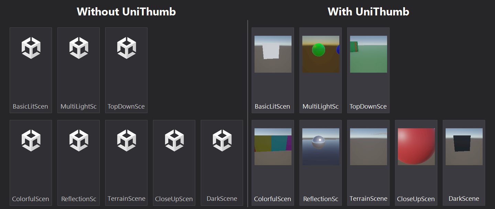
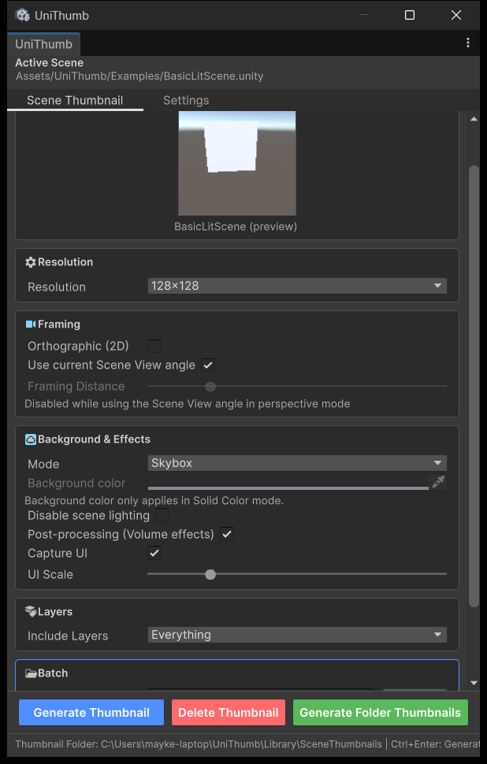
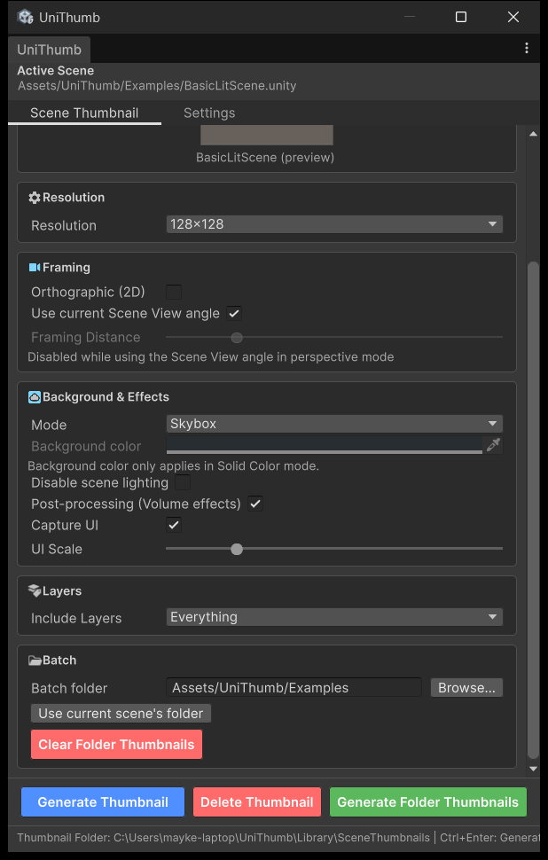

# UniThumb

Renders scene thumbnails and draws them on the scene asset icons in the Project window, so you can actually tell your scenes apart at a glance instead of squinting at identical file icons.



## Features

- Renders any scene and stamps the thumbnail onto its asset icon in the Project window
- Resolution presets: 16, 32, 64, 128, 256, 512 px (128 default)
- Orbit camera around scene bounds, or just reuse your Scene View angle
- Skybox or solid color background
- Optional lighting override
- Can capture Screen Space Overlay UI into the shot
- URP post-processing support (via reflection, so it doesn't hard-depend on URP)
- HDR to sRGB readback with corrupt-image detection and a fallback render path
- Automatically retries at lower resolution if a render is too large
- Thumbnails go stale and regenerate automatically when a scene is saved/modified
- Batch generation with progress bar and cancel
- Editor-only, nothing ships in builds

## Requirements

- Unity 2022.3 LTS or newer (Unity 6 gets the native TabView UI)
- Works with Built-in, URP, or HDRP — no render pipeline package required
- Uses UGUI (CanvasScaler, GraphicRaycaster, Image, Text), which every standard Unity project already has
- Editor-only, doesn't touch your build

If URP isn't installed, post-processing support just turns off — no compile errors.

## Installation

### Git URL

Window > Package Manager > + > Add package from git URL:

```
https://github.com/MaykerStudio/uni-thumb.git
```

Package lives at the repo root, no path suffix needed.

### Tarball

Build a `.tgz` with `scripts/pack-unithumb.ps1` (or plain `npm pack`), then Window > Package Manager > + > Add package from tarball and pick the file.

### Embedded (dev only)

`Project~/UniThumb Dev` installs the root package via the git URL above, or a `file:` reference when you're testing local changes. The trailing `~` keeps the folder out of Unity's import and out of package tarballs; the whole tree is gitignored.

## Usage

Open via `Window > UniThumb`. Two sections — native tabs on Unity 6, header buttons on 2022.3:

- **Scene Thumbnail** — capture settings, live preview, generate/delete for the active scene
- **Settings** — storage mode and related options



Screenshots show the Unity 6 layout; 2022.3 swaps the tabs for header buttons, same content.

Shortcuts (inside the window):

- `Ctrl+Enter` / `Cmd+Enter` — generate thumbnail for the current scene
- `Ctrl+Shift+Enter` — batch generate for the whole folder
- `Esc` — cancel a running batch

Getting started:

1. `Window > UniThumb`
2. With a scene open, generate its thumbnail from the window
3. Or right-click a scene asset in the Project window and use `Assets > Generate UniThumb`
4. Thumbnail shows up on the asset icon in the Project window

There's also a batch section: pick a folder (or default to the current scene's), generate for every scene in it, or clear a folder's thumbnails with a confirmation prompt. Progress bar, cancellable.



### Menu reference

| Menu item | Description |
| --- | --- |
| `Window > UniThumb` | Opens the UniThumb window |
| `Assets > Generate UniThumb` | Generates a thumbnail for the selected scene |
| `Assets > Clear UniThumb` | Deletes the thumbnail of the selected scene |
| `Assets > Refresh All UniThumbs` | Regenerates everything, including stale ones |
| `Assets > Generate UniThumbs in Folder` | Generates for every scene in a folder |
| `Tools > UniThumb > Generate Example Scenes` | Drops 10 example scenes into `Assets/UniThumb/Examples` to try the tool out |

## Storage

Thumbnails are PNGs named after the scene GUID — no `.meta` files, no clutter in the Project window. Nothing gets imported as a texture asset either, so there's no import settings and no wasted disk space.

Two modes, set in the Settings section:

- **Library cache** (default) — `Library/SceneThumbnails/{sceneGuid}.png`, outside `Assets`. Machine-local, fully regenerable. Delete the folder and run `Assets > Refresh All UniThumbs` to rebuild from scratch.
- **Tracked in Assets** — `Assets/UniThumb/Thumbnails/`. Commit these if you want the team to share the same thumbnails.

Switching modes moves existing files over automatically.

## Examples

No example scenes ship with the package. Run `Tools > UniThumb > Generate Example Scenes` and it writes 10 editable scenes into `Assets/UniThumb/Examples` (folder created if missing) so you can poke around without setting up your own scenes first.

## Repository layout

Repo root is the package root, so the plain git URL installs it as-is:

```
root/                    <- the UPM package (package.json at the root)
  package.json           package manifest
  Editor/                UniThumb.Editor assembly: 10 .cs files, asmdef, uxml/uss
  README.md              this file
  CHANGELOG.md           version history
  LICENSE.md             BSD 3-Clause license
  images/                README screenshots
  scripts/               pack-unithumb.ps1 (tarball build)
  Project~/UniThumb Dev/ Unity dev project (gitignored, installs the package via git URL)
  dist/                  tarball output (gitignored)
  docs/                  planning notes, never shipped
```

## Development

- Dev project lives in `Project~/UniThumb Dev`, installs the root package via the git URL (or a `file:` reference for local changes). The `~` keeps it out of Unity imports and tarballs.
- `scripts/pack-unithumb.ps1` packs the repo root into `dist/com.maykerstudio.unithumb-<version>.tgz` (npm pack, with tar/zip fallbacks). Excludes `Project/`, `Project~/`, `docs/`, `scripts/`, `dist/`, `AGENTS.md`, and all `.meta`/`.unity`/`.prefab` files. `images/` is included so the README renders correctly once installed.
- Commit `package.json`, `Editor/`, `README.md`, `CHANGELOG.md`, `LICENSE.md`, `images/`. Keep `Project~/`, `docs/`, and `Packages/*.json` out.

## Contributing

To set up a development environment:

1. Clone the repository.
2. Create a new Unity project anywhere on disk. It does not need to be inside the repo or the `Project/` folder.
3. Open **Window > Package Manager** in that project.
4. Click **+** > **Add package from disk...** and navigate to the cloned repo root.
5. Select `package.json`. The package is now installed in your test project.
6. Any changes you make to the `Editor/` folder in the repo are reflected immediately.

## Roadmap

See [ROADMAP.md](ROADMAP.md) for upcoming features and improvements.

## License

BSD 3-Clause. Copyright (c) 2026, MaykerStudio. See LICENSE.md.