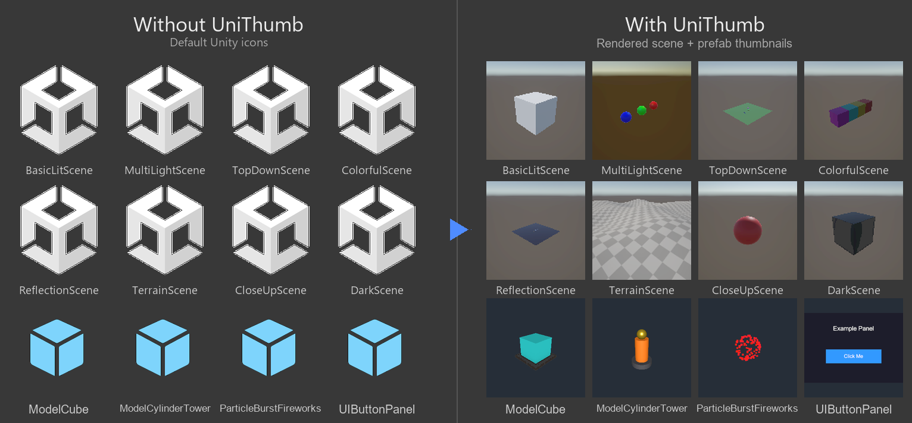

# UniThumb

[](package.json)
[](LICENSE.md)

UniThumb renders a thumbnail for each scene and prefab and pins it to the asset icon in the Project window, so you don't have to open the asset to know what's inside.



## Find assets faster

Unreal shows thumbnail previews for every asset. Unity still hands you the same grey icon for scenes and prefabs, so a folder full of names like Level_Final_v2 tells you nothing until you open each one. UniThumb fixes that — one button renders the actual content into the icon, so the right asset is obvious at a glance.

https://github.com/user-attachments/assets/424dbc08-fc0e-4beb-b597-9606f8e1d0df

## Features

### Capture

- One-click generation with live preview before committing.
- Prefab generation needs no open Prefab Stage: UniThumb stages each prefab apart from scene content and reverts through Undo, so the open scene stays as found.
- Two framing modes cover 2D and 3D: Scene View angle copies the current view, while Orbit frames full bounds.

### Rendering

- One workflow covers URP 3D, URP 2D, and HDRP, setting renderer, lights, and exposure per shot — 2D uses Global lights, 3D keeps the sun directional light, and HDRP is metered in physical units with an exposure baseline.
- The shot matches the screen: volumes supply post in URP and HDRP, particles and VFX get prerolled, and overlay UI composites in a second pass.
- Backgrounds run skybox or flat color, with transparent output for clean icons.

### Batch workflow

- Generate whole folders of scenes and prefabs at once, fill in only missing thumbnails, and stop a running batch.
- Optional auto-regeneration on save.

### Storage

- Thumbnails live under `Library` for solo work, under `Assets` for team sharing.

## Requirements

- Unity 2022.3 LTS or newer, with one layout serving 2022.3 and Unity 6.
- Works with URP 3D, URP 2D, and HDRP; Built-in isn't tested — see Contributing.
- Editor-only.

## Installation

Window > Package Manager > + > Add package from git URL:

```text
https://github.com/MaykerStudio/uni-thumb.git
```

To install from a tarball, build one with `scripts/pack-unithumb.ps1` and use Add package from tarball. For local development, add the repo root with Add package from disk, or add a `file:` entry to `Packages/manifest.json`.

## Usage

Open `Window > UniThumb`:

- **Scene Thumbnail:** generation settings, live preview, and generate/delete for the active scene
- **Settings:** storage mode, Regenerate on Save, icon overlay, padding, max size, and cache limit


Shortcuts:

- `Ctrl+Enter` / `Cmd+Enter`: generate for the current scene
- `Ctrl+Shift+Enter`: batch generate the folder
- `Esc`: cancel a running batch

Right-click scenes and prefabs for `Assets > Generate UniThumb` and `Assets > Clear UniThumb`. Refresh All fills gaps and Generate in Folder batches. Regenerate on Save refreshes the thumbnail on each save while the window stays open. `Tools > UniThumb > Generate Example Scenes` writes 10 example scenes to `Assets/UniThumb/Examples`.

## Storage

UniThumb names each PNG after the asset GUID without writing `.meta` files or importing the PNGs as textures; switching storage mode moves existing files.

## Contributing

PRs are welcome, including Built-in render pipeline support; see [CONTRIBUTING.md](CONTRIBUTING.md) for setup, verification, and commit guidelines. The EditMode test suite lives in `Tests/Editor/`.

## AI disclosure

AI assistance was used during development.

## License

BSD 3-Clause. See [LICENSE.md](LICENSE.md).
